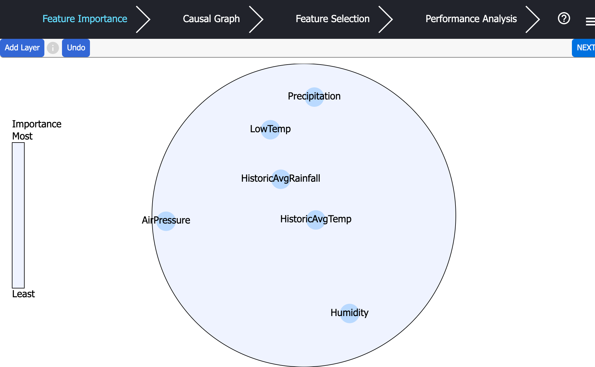
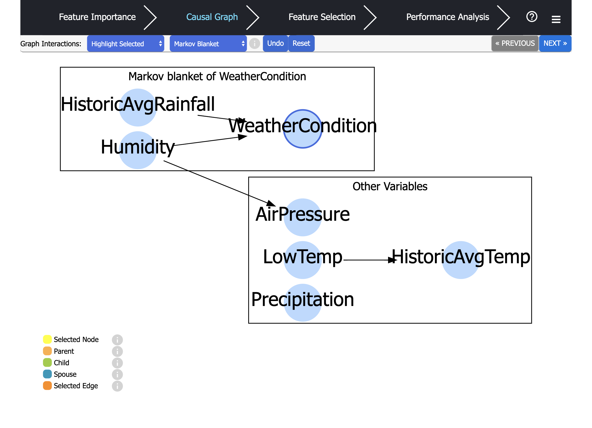
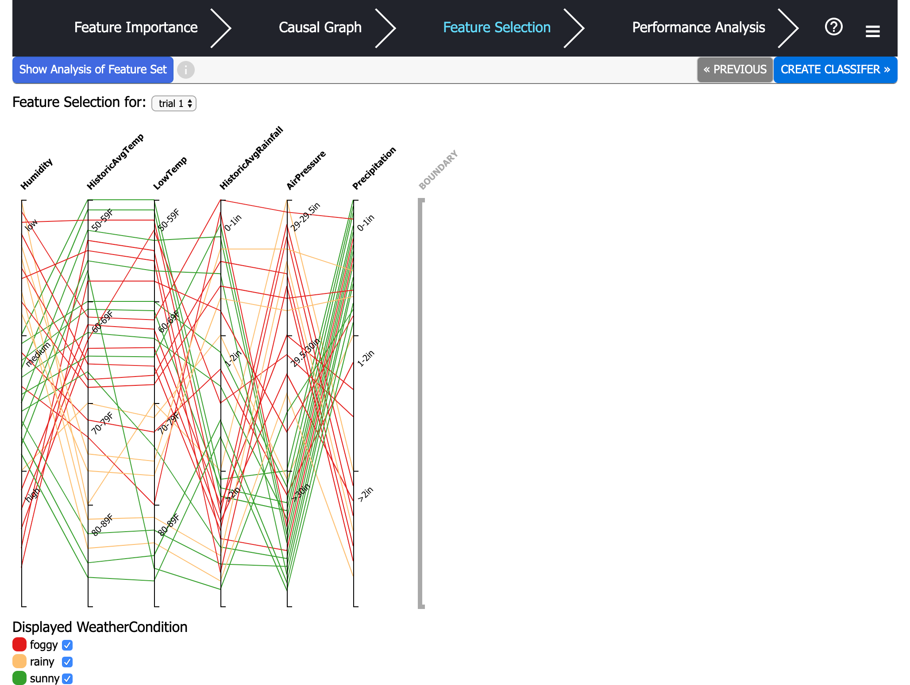
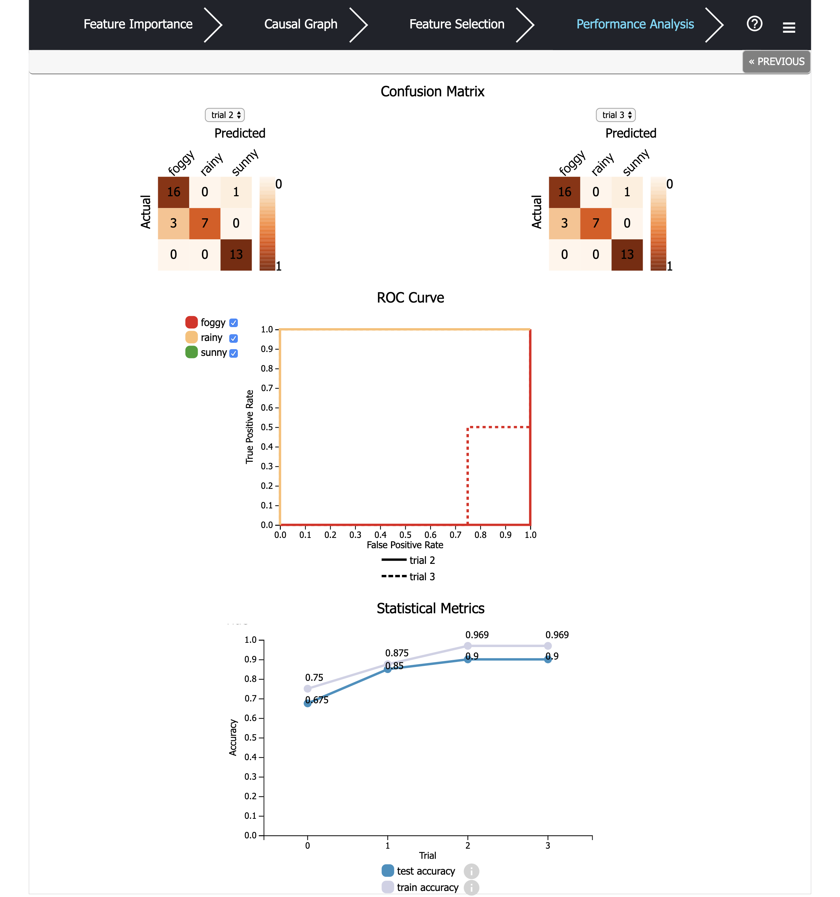

# Interactive Feature Selection (IFS)
Interactive feature selection is a web application that involves the user in the feature selection preprocessing step in the machine learning process. Common automated feature selection algorithms search the space of feature subsets by optimizing a criterion function. Automated algorithms lack transparency and may output feature sets that are predictive of the training data but not of the underlying data generating mechanisms.

IFS incorporates the human expert who understands the classification problem domain and the semantics of the input data. The IFS workflow includes:
1. the user visually ranks the features by importance and expresses causal relationships among the features. 
2. The application visualizes the user's inputs, provides analytics, and visualizes the dataset using parallel coordinates. 
3. The user interactively selects a feature subset to build a model. 
4. The user uses the visualization of the traing results to iteratively select feature subsets and generate high performing and more transparent models. 

## Accessing
To see access the web application with a pre-loaded dataset go to http://35.192.120.176:8889/demo

## Tutorials 
1. [Express Feature Importance](https://screencast-o-matic.com/watch/cqV3rX3ZtO)
2. [Build Causal Graph](https://screencast-o-matic.com/watch/cqehqu00u4)
3. [Feature Selection](https://screencast-o-matic.com/watch/cqV0nP3ZsW)
4. [Feature Selection Analysis](https://screencast-o-matic.com/watch/cqV3rb3ZtL)
5. [Performance Analysis](https://screencast-o-matic.com/watch/cqnXnj37X7)
6. [Compare Classifiers](https://screencast-o-matic.com/watch/cqnXn73728)

## Components
### Feature Importance 
Rank features by importances by creating groupings of features with relatively the same level of importance. The inner groups are more important. The features outside of the groups are not relevant to the classification problem. 
 

### Causal Graph
Pycausal library is utilized to initialize the causal graph using the input data. User then add, remove, reverse edges to reflect their knowledge of the causal relationship among features.  

### Data Visualization and Feature Selection 
Visualize the high dimensional dataset using parallel coordinates. The parallel coordinates are features. Features can be moved and the visualization dynamically updates. A boundary coordinate is used to indicate the selected feature set - features on the left of the boundary are selected and those on the right are not. After features are selected, a classifier is generated. 

### Performance Analysis
Confusion matrix, ROC curve, and statistic metrics are shown to help the user analyze the classifer and decide how to improve the classifier in the next iteration. User can go to the feature selection step to select a new set of features to create another model. User can compare the performance of the models.  

### Dependencies
[Pycausal](https://github.com/bd2kccd/py-causal)

